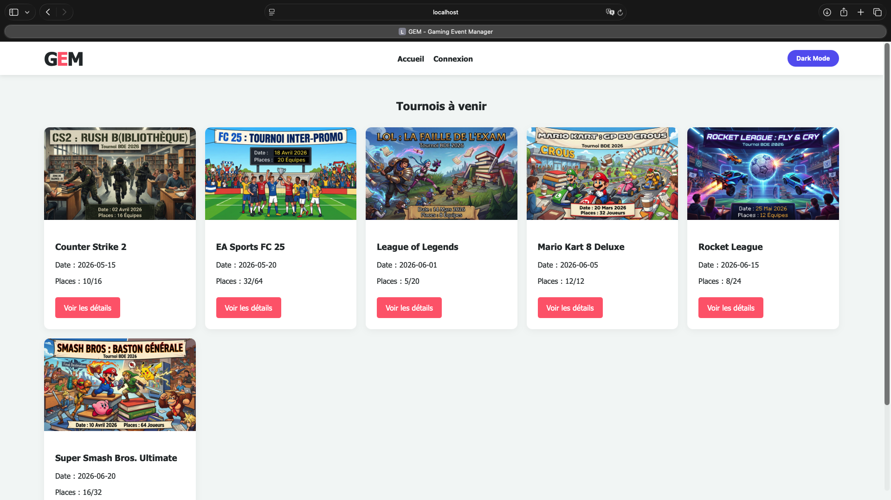

# Gaming Event Manager (GEM)

## Présentation

Gaming Event Manager (GEM) est une application web développée dans le cadre du module de développement web en deuxième année de Licence Informatique à l'Université de Strasbourg.

L'objectif du projet est de proposer une plateforme permettant de gérer des tournois E-sport organisés par une association étudiante (BDE). Les utilisateurs peuvent consulter les tournois, créer un compte, inscrire leur équipe et les administrateurs peuvent consulter les inscriptions.

---

## Fonctionnalités

- Consultation des tournois disponibles
- Page de détail pour chaque tournoi
- Création de compte utilisateur
- Connexion sécurisée
- Inscription d'une équipe à un tournoi
- Tableau de bord administrateur
- Mode clair / mode sombre
- Interface responsive (ordinateur, tablette et mobile)

---

## Technologies utilisées

- HTML5
- CSS3
- JavaScript
- PHP 8
- SQLite
- Git

---

## Architecture

- PHP avec réutilisation des composants (`header`, `footer`, ...)
- Base de données SQLite
- Requêtes préparées (PDO)
- Gestion des sessions PHP
- Validation côté client (JavaScript)
- Validation côté serveur (PHP)

---

## Captures d'écran

### Accueil

### Détails d'un tournoi

### Tableau de bord administrateur

---

## Sujet

Le sujet du projet est disponible dans le dossier :
docs/Sujet_GEM.pdf

---

## Installation

Lancer le serveur PHP :
php -S localhost:8080

Pour ouvrir: 
http://localhost:8080